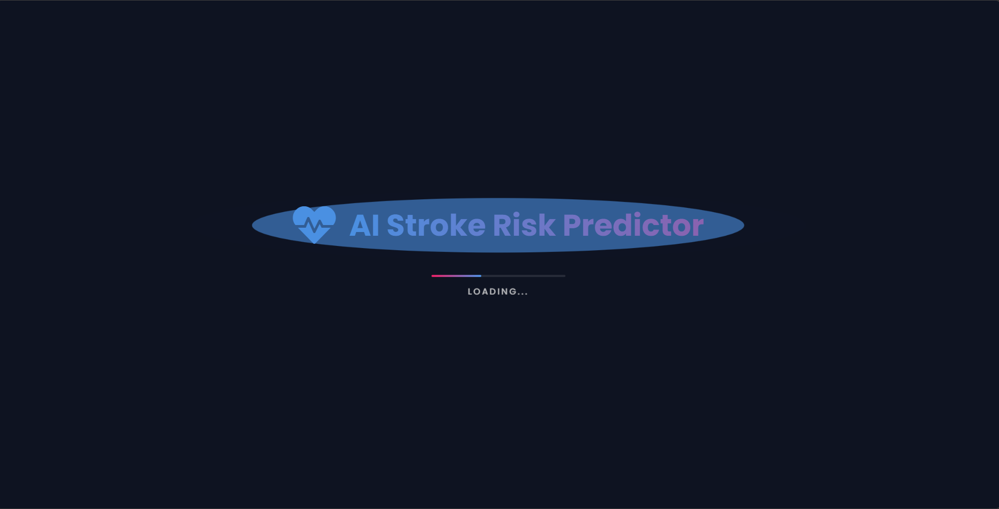
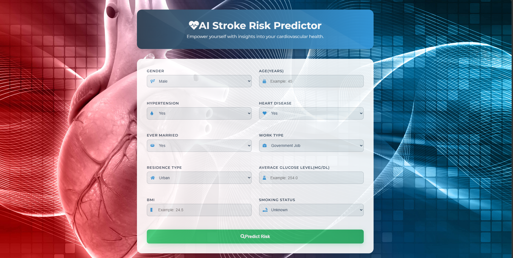
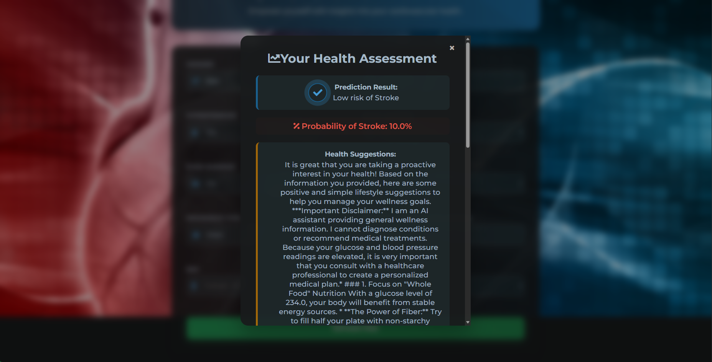

# 🧠 AI Stroke Risk Predictor

A sophisticated web application that leverages Machine Learning to predict stroke risk and utilizes Google's Gemini 3 AI to provide personalized health lifestyle suggestions. Designed with a premium, dark-themed UI for a seamless user experience.

---

## 📸 Visual Overview

### 🎨 App Showcase
````carousel

<!-- slide -->

<!-- slide -->

<!-- slide -->

````

---

## ✨ Key Features

- **🎯 Precision ML Prediction**: Uses a custom-trained Random Forest Classifier to analyze 10+ clinical parameters.
- **🤖 Gemini 3 Integration**: Powered by the latest Gemini 3 Flash model for intelligent, context-aware health suggestions.
- **💎 Premium UI/UX**: Responsive dark mode interface with smooth transitions, animated splash screens, and glassmorphism.
- **🔒 Secure Architecture**: Environment-based configuration to protect sensitive API keys.
- **📊 Data Processing**: Robust data pipeline for handling missing values and categorical encoding.

---

## 🛠️ Technology Stack

- **Core**: [Python 3.8+](https://www.python.org/)
- **Web Framework**: [Flask](https://flask.palletsprojects.com/)
- **Machine Learning**: [Scikit-Learn](https://scikit-learn.org/), [Pandas](https://pandas.pydata.org/), [NumPy](https://numpy.org/)
- **AI Intelligence**: [Google Gemini 3 Flash](https://ai.google.dev/)
- **Frontend**: HTML5, CSS3 (Vanilla), JavaScript
- **Deployment**: [Vercel](https://vercel.com/) / [Gunicorn](https://gunicorn.org/)

---

## 🚀 Getting Started

### 📋 Prerequisites
- Python 3.8 or higher
- A Google Gemini API Key

### ⚙️ Installation & Setup

1. **Clone the Repository**
   ```bash
   git clone https://github.com/yourusername/StrokeProject.git
   cd StrokeProject
   ```

2. **Environment Setup**
   ```bash
   python -m venv venv
   source venv/bin/activate  # Windows: venv\Scripts\activate
   pip install -r requirements.txt
   ```

3. **Configure API Key**
   Create a `.env` file in the root directory:
   ```env
   GEMINI_API_KEY=your_api_key_here
   ```

4. **Run the Application**
   ```bash
   python app.py
   ```
   Visit `http://127.0.0.1:5000` in your browser.

---

## 📈 Model Training
If you wish to retrain the model with fresh data:
1. Ensure `healthcare-dataset-stroke-data.csv` is in the root directory.
2. Run the training script:
   ```bash
   python train_model.py
   ```
3. This will update `stroke_model.pkl` and `label_encoders.pkl`.

---

## 📁 Project Structure
```text
.
├── app.py                  # Main Flask Web Server
├── train_model.py          # ML Training Pipeline
├── stroke_model.pkl        # Serialized Random Forest Model
├── label_encoders.pkl      # Categorical Data Encoders
├── requirements.txt        # Project Dependencies
├── .env                    # Secure API Configurations
├── screenshots/            # Visual Assets for README
├── templates/              # HTML UI Components
└── vercel.json             # Vercel Deployment Config
```

---

## ⚠️ Medical Disclaimer
> [!IMPORTANT]
> This application is for **educational and informational purposes only**. The predictions generated are based on statistical patterns and should not be considered medical diagnoses. Always consult a qualified healthcare professional for medical advice.

---

## 📄 License
Distributed under the **MIT License**. See `LICENSE` for more information.
